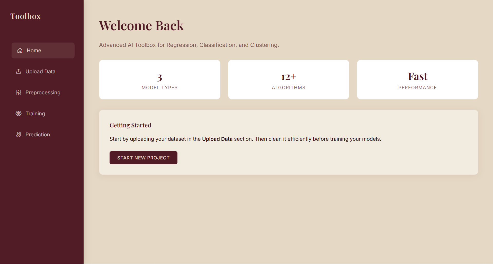
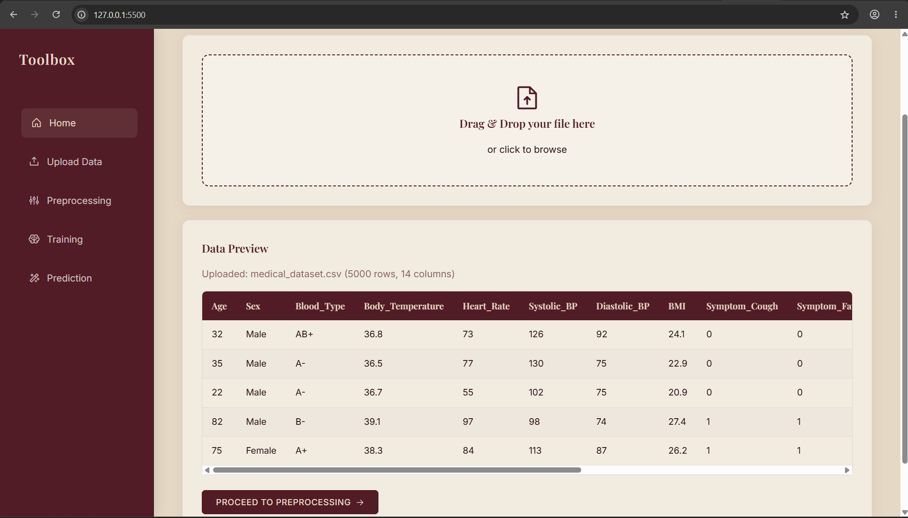
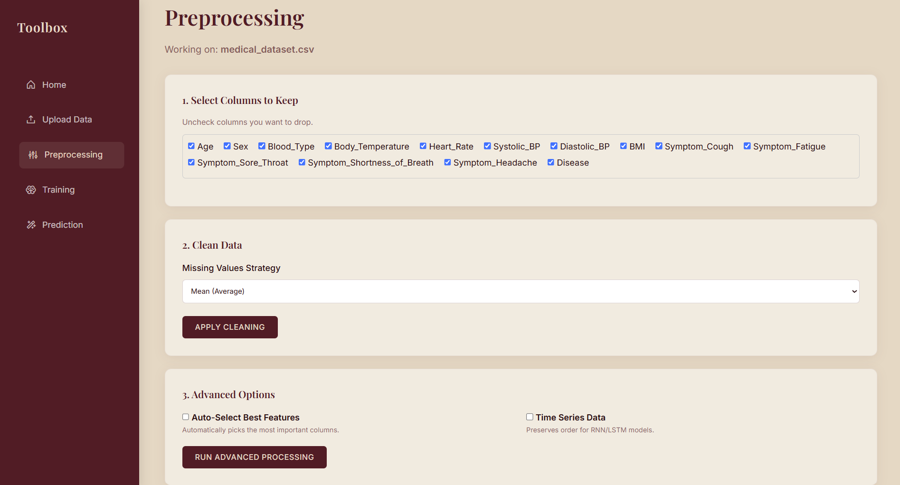
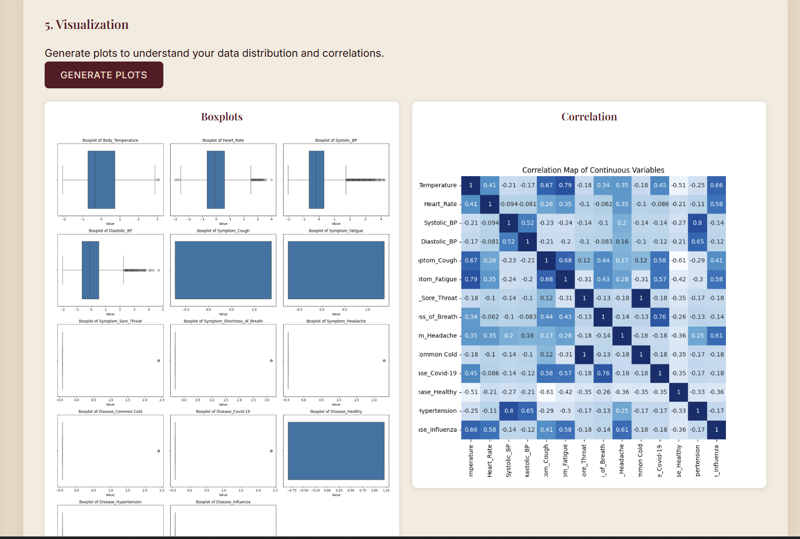
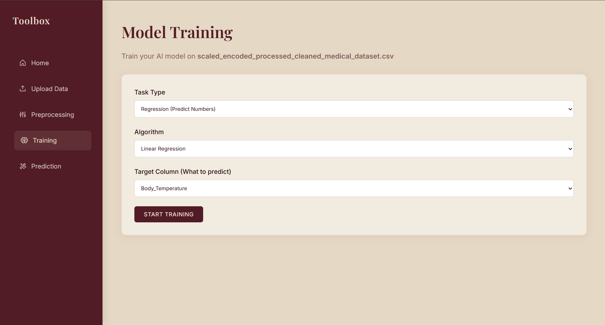
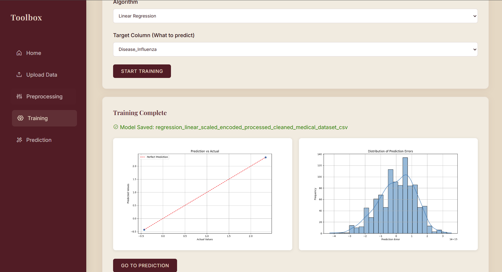
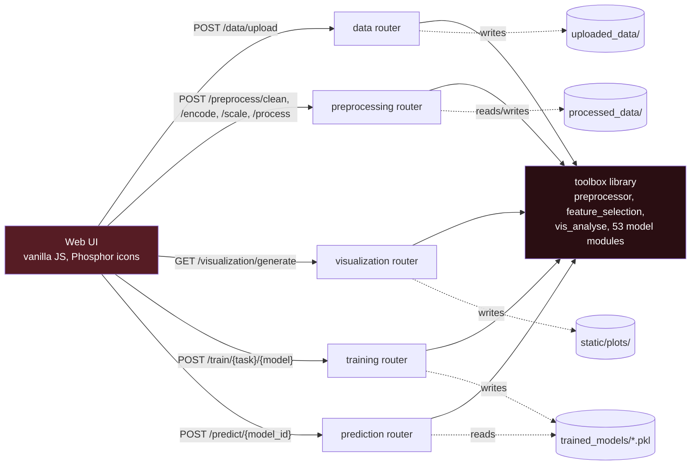
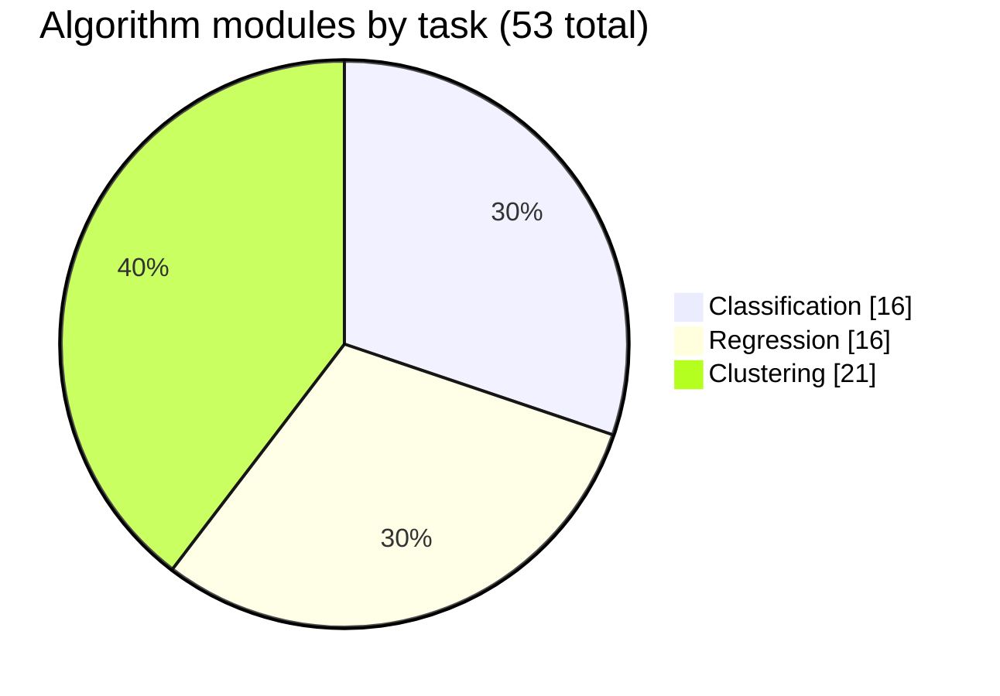

<div align="center">


# AI / ML Toolbox

### Upload a dataset. Clean it, visualize it, train a model, and predict — all from one interface, backed by a from-scratch library of 53 algorithm modules.

[](toolbox/requirements.txt)
[](api/main.py)
[](toolbox/requirements.txt)
[](toolbox/requirements.txt)
[](toolbox/requirements.txt)
[](ui)

[](https://github.com/flash-hero/AI-ML-toolbox/commits/main)
[](https://github.com/flash-hero/AI-ML-toolbox)
[](https://github.com/flash-hero/AI-ML-toolbox/stargazers)

</div>

<p align="center">
  
</p>

---

## Table of Contents

- [Overview](#overview)
- [Workflow](#workflow)
- [Architecture](#architecture)
- [Algorithm Library](#algorithm-library)
- [Tech Stack](#tech-stack)
- [Two Ways to Run It](#two-ways-to-run-it)
- [Project Structure](#project-structure)
- [Getting Started](#getting-started)
- [API Reference](#api-reference)
- [Testing](#testing)
- [Roadmap](#roadmap)
- [License](#license)

---

## Overview

**AI / ML Toolbox** is a machine learning workbench with two layers:

| Layer | Description |
|---|---|
| `toolbox/` | A standalone Python library with its own preprocessing, feature selection, visualization, and 53 algorithm modules across classification, regression, and clustering. Usable independently of any UI. |
| `api/` + `ui/` | A FastAPI service that wraps the library behind a REST API, paired with a vanilla-JavaScript single-page interface for uploading data, cleaning it, visualizing it, training a model, and generating predictions — no notebook required. |

The interface follows the same five stages as the sidebar: **Home, Upload Data, Preprocessing, Training, Prediction.**

---

## Workflow

<table>
<tr>
<td width="50%" valign="top">



**1. Upload**
Drag and drop a CSV or Excel file. The preview table confirms shape and column types before anything is processed.

</td>
<td width="50%" valign="top">



**2. Preprocess**
Drop columns, choose a missing-value strategy, and optionally turn on automatic feature selection or time-series mode.

</td>
</tr>
<tr>
<td width="50%" valign="top">



**3. Visualize**
One click generates boxplots for every numeric column plus a correlation heatmap, rendered server-side and served as static images.

</td>
<td width="50%" valign="top">



**4. Train**
Pick a task type, an algorithm, and a target column. The API splits the data, trains, evaluates, and saves the model.

</td>
</tr>
</table>

<p align="center">
  
</p>

<p align="center"><strong>5. Evaluate and predict</strong> — a Prediction-vs-Actual plot and an error-distribution histogram render immediately after training, and the saved model becomes available for the Prediction page.</p>

---

## Architecture



Every stage is a thin FastAPI router over the `toolbox` library — the routers handle file I/O and request validation, `DataPreprocessor`, `DataAnalyzer`, and the model classes do the actual work, and results are written to disk (`processed_data/`, `static/plots/`, `trained_models/`) so each stage can pick up where the previous one left off by filename.

---

## Algorithm Library



| Task | Classical ML | Deep learning | Notes |
|---|---|---|---|
| Classification | 14 (Logistic Regression, Random Forest, SVM, KNN, Decision Tree, Naive Bayes, LDA, QDA, XGBoost, LightGBM, CatBoost, AdaBoost, Bagging, Extra Trees) | 2 (LSTM, GRU) | |
| Regression | 14 (Linear, Bayesian Linear, Bayesian Ridge, Random Forest, SVR, KNN, Decision Tree, Gaussian Process, Gradient Boosting, XGBoost, LightGBM, CatBoost, AdaBoost, Extra Trees) | 2 (LSTM, GRU) | |
| Clustering | 21 (KMeans, Mini-Batch KMeans, K-Medoids, K-Modes, K-Prototypes, DBSCAN, HDBSCAN, OPTICS, Mean Shift, Affinity Propagation, Agglomerative, BIRCH, Divisive Hierarchical, Spectral, CLARANS, COP-KMeans, Fuzzy C-Means, C-Means, Density Peaks, Self-Organizing Maps) | — | |

The library implements all 53; the API's model-selection dispatcher (`api/routers/training.py`) currently wires up a working subset — Logistic Regression, Random Forest, KNN, Decision Tree, SVM, Naive Bayes, XGBoost, LSTM and GRU for classification, and Linear Regression for regression, which is also what the Training page's dropdown reflects today. Extending the dispatcher to cover the rest of the library is the single highest-leverage next step — see [Roadmap](#roadmap).

---

## Tech Stack

| Layer | Stack |
|---|---|
| **Backend API** | FastAPI, Pydantic, Uvicorn |
| **ML / Data** | pandas, NumPy, scikit-learn, scikit-learn-extra, XGBoost, LightGBM, CatBoost |
| **Deep learning** | TensorFlow, Keras, Keras Tuner |
| **Bayesian** | PyMC, ArviZ |
| **Clustering extras** | HDBSCAN, scikit-fuzzy, MiniSom, kmodes, NetworkX |
| **Visualization** | Matplotlib, Seaborn |
| **Frontend** | Vanilla JavaScript, Phosphor Icons, Google Fonts (Playfair Display, Inter) |
| **Storage** | Flat files — CSV in `uploaded_data/` and `processed_data/`, PNG in `static/plots/`, pickled models in `trained_models/` |

The interface follows a "Modern Luxury" palette — maroon (`#561C24`) on cream (`#E8D8C4`), Playfair Display for headings, Inter for body text — visible throughout the screenshots above.

---

## Two Ways to Run It

**Web application** — the interface shown above. FastAPI backend plus the `ui/` single-page app; this is the primary, actively developed way to use the toolbox.

**Command-line menu** — `toolbox/menu.py` is an interactive terminal session that walks through the same stages (load a file, clean it, choose classification, regression, or clustering, pick a target column) without a browser. A leftover copy of the same script also sits at the repository root (`menu.py`); the version inside `toolbox/` is the more current and better-documented one.

---

## Project Structure

```
AI-ML-toolbox/
├── api/
│   ├── main.py                  # FastAPI app, router registration, CORS, static mount
│   ├── schemas.py                # Pydantic request/response models
│   └── routers/
│       ├── data.py               # Upload, preview
│       ├── preprocessing.py      # Clean, encode, scale, unified process
│       ├── visualization.py      # Boxplots, correlation heatmap
│       ├── training.py           # Model dispatch, train, evaluate, save
│       └── prediction.py         # Load a saved model, predict
├── toolbox/
│   ├── data_collection.py        # File import, delimiter detection
│   ├── preprocessor.py           # DataPreprocessor — cleaning, encoding, scaling, splitting
│   ├── feature_selection.py      # FeatureSelector — chi2, mutual info, ANOVA/Kruskal
│   ├── vis_analyse.py            # DataAnalyzer — boxplots, correlation, statistical tests
│   ├── classificationModels/     # 14 classical + 2 RNN classifiers
│   ├── regressionModels/         # 14 classical + 2 RNN regressors
│   ├── clusteringModels/         # 21 clustering algorithms
│   ├── evaluationModels/         # ClassifierEvaluator, RegressionEvaluator
│   ├── menu.py                   # Current CLI entry point
│   └── requirements.txt
├── ui/
│   ├── index.html
│   ├── css/ (style.css, components.css)
│   └── js/ (api.js, ui.js, app.js)
├── uploaded_data/                 # Raw uploads land here
├── processed_data/                # Cleaned / encoded / scaled CSVs
├── static/plots/                  # Generated boxplot and correlation images
├── trained_models/                # Pickled (or .h5) trained models
├── tests/test_api.py              # FastAPI TestClient end-to-end test
└── menu.py                        # Older copy of the CLI menu
```

---

## Getting Started

### Prerequisites

- Python 3.11
- A modern browser (the UI is a static single-page app)

### 1. Install dependencies

```bash
pip install -r toolbox/requirements.txt
pip install fastapi uvicorn python-multipart
```

`fastapi`, `uvicorn`, and `python-multipart` aren't yet listed in `toolbox/requirements.txt` — they're needed to run the API layer and are worth adding there.

### 2. Start the API

```bash
uvicorn api.main:app --reload --port 8000
```

Run this from the repository root. Interactive API docs are then available at `http://127.0.0.1:8000/docs`.

### 3. Serve the UI

```bash
python -m http.server 5500 --directory ui
```

Then open `http://127.0.0.1:5500`. The screenshots above were captured with VS Code's Live Server extension on the same port; any static file server works.

### Or use the command-line menu instead

```bash
cd toolbox
python menu.py
```

Walks through the same load, clean, select-problem-type, train, evaluate sequence directly in the terminal — no API or browser needed.

---

## API Reference

| Method | Endpoint | Body | Returns |
|---|---|---|---|
| `POST` | `/data/upload` | multipart file (CSV or Excel) | Filename, row/column counts, dtypes |
| `GET` | `/data/preview/{filename}` | `?rows=5` | First N rows as JSON |
| `POST` | `/preprocess/clean` | filename, impute strategy, columns to drop | Cleaned dataset info |
| `POST` | `/preprocess/encode` | filename, encode method, target column | Encoded dataset info |
| `POST` | `/preprocess/scale` | filename, scale method | Scaled dataset info |
| `POST` | `/preprocess/process` | filename + full option set | Cleaned, selected, scaled, encoded (and time-series-prepared) dataset in one call |
| `GET` | `/visualization/generate/{filename}` | — | Paths to generated boxplot and correlation images |
| `GET` | `/visualization/list/{filename}` | — | All existing plot URLs for a file |
| `POST` | `/train/{task_type}/{model_name}` | filename, target column, test size | Model ID, evaluation metrics, plot URLs |
| `POST` | `/predict/{model_id}` | rows to predict, as JSON records | Predicted values |
| `GET` | `/health` | — | Service status |

Full interactive documentation (request/response schemas, try-it-out) is auto-generated by FastAPI at `/docs` once the API is running.

---

## Testing

```bash
pip install httpx
python -m pytest tests/test_api.py -v
```

`tests/test_api.py` runs an end-to-end flow through FastAPI's `TestClient` — upload, preview, clean, train a Linear Regression model, then predict — without needing the server or UI running.

---

## Roadmap

- Wire the remaining 40+ algorithm modules (currently implemented in `toolbox/` but not yet reachable from `training.py`'s model dispatcher) into the API and the Training page's dropdown
- Route the clustering task type end-to-end — `KMeansClustering` is imported in `training.py` but not yet called from the training endpoint
- Add `fastapi`, `uvicorn`, and `python-multipart` to a proper requirements file for the API layer
- Add a `.gitignore` for `__pycache__/`, `uploaded_data/`, `processed_data/`, `static/plots/`, and `trained_models/` so generated artifacts stop being committed
- Retire the root-level `menu.py` in favor of the more current `toolbox/menu.py`, and remove the stray local path in `under.txt`

---

## License

No license file yet — this repository is currently all-rights-reserved by default. Consider adding an [MIT license](https://choosealicense.com/licenses/mit/) if you want others to freely use or fork it.

---

<div align="center">

Built by <a href="https://github.com/flash-hero">Oussama Tabakh</a>

</div>
